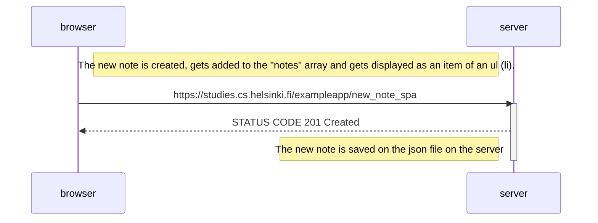

```mermaid
sequenceDiagram
    participant browser
    participant server

    note right of browser: The new note is created, gets added to the "notes" array and gets displayed as an item of an ul (li).
    browser->>server: https://studies.cs.helsinki.fi/exampleapp/new_note_spa
    activate server
    server-->>browser: STATUS CODE 201 Created 
    note left of server: The new note is saved on the json file on the server
    deactivate server
   
```